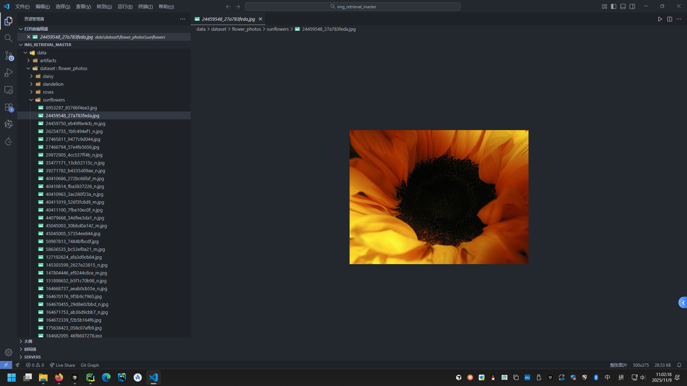
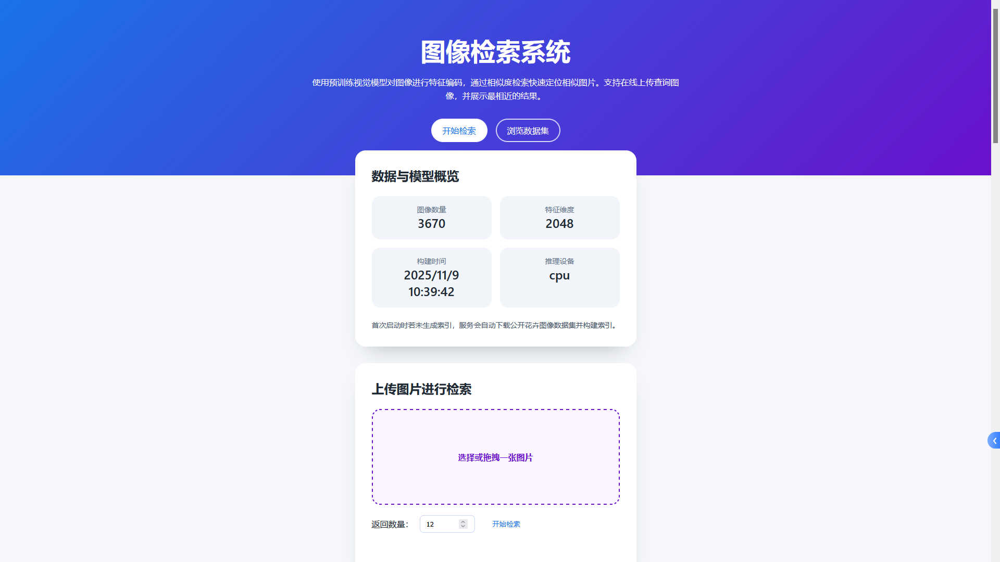
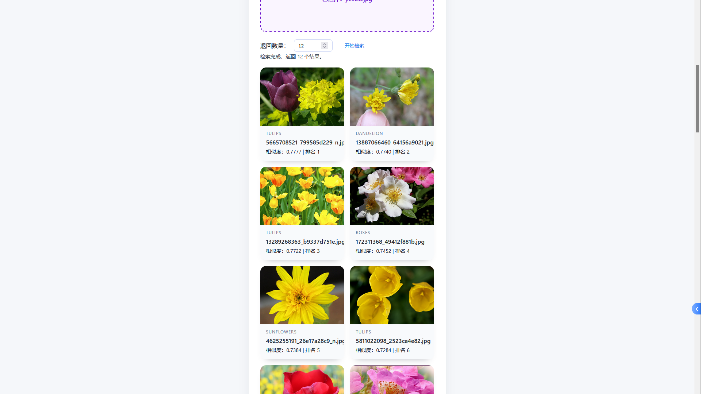

# 图像检索系统实验报告

> **项目名称**：开放数据集图像检索系统
> **技术栈**：Node.js + Express + Python + PyTorch
> **数据集**：TensorFlow Flower Photos（官方公开花卉图像数据集）
> **作者**：钟林林
> **完成日期**：2025 年 11 月 9 日

---

## 目录

1. [实验背景与目标](#实验背景与目标)
2. [总体设计与系统架构](#总体设计与系统架构)
   1. [功能需求分析](#功能需求分析)
   2. [技术选型说明](#技术选型说明)
3. [实现方法](#实现方法)
   1. [数据准备与管理](#数据准备与管理)
   2. [特征提取原理与模型说明](#特征提取原理与模型说明)
   3. [索引构建与检索策略](#索引构建与检索策略)
   4. [跨语言通信机制](#跨语言通信机制)
   5. [Web 前端设计与交互逻辑](#web-前端设计与交互逻辑)
   6. [服务端接口设计](#服务端接口设计)
   7. [运行流程与关键命令](#运行流程与关键命令)
4. [核心代码详解](#核心代码详解)
   1. [Python 工具集详解](#python-工具集详解)
   2. [Node.js 后端模块解析](#nodejs-后端模块解析)
   3. [前端页面逻辑说明](#前端页面逻辑说明)
5. [实验创新点](#实验创新点)
6. [实验过程与结果展示](#实验过程与结果展示)
   1. [实验环境配置](#实验环境配置)
   2. [数据集处理情况](#数据集处理情况)
   3. [检索效果对比与分析](#检索效果对比与分析)
   4. [性能评估与瓶颈分析](#性能评估与瓶颈分析)
7. [风险与不足](#风险与不足)
8. [总结与展望](#总结与展望)
9. [附录](#附录)
   1. [完整项目目录结构](#完整项目目录结构)
   2. [关键命令速查表](#关键命令速查表)
   3. [参考资料](#参考资料)

---

## 实验背景与目标

图像检索（Image Retrieval）技术旨在根据输入图像在图库中找出相似图像，其核心在于**特征表示**与**相似度度量**。传统方法依赖手工设计的特征（如 SIFT、SURF），计算复杂且在跨域任务中表现不佳。随着深度学习的发展，卷积神经网络（CNN）可以学习到更加区分性和鲁棒的特征表示，使得基于深度学习的图像检索成为主流。

本实验的目标是：

1. 构建一个**端到端的图像检索系统**，涵盖数据准备、特征提取、索引存储、在线查询与结果展示等完整流程。
2. 采用纯文件存储索引的方式，尽量减少外部依赖，降低部署门槛。
3. 提供一个友好的 Web 界面，支持用户实时上传图片进行检索，同时可浏览数据集示例。
4. 通过 Node.js 和 Python 跨语言协作，兼顾**Web 开发效率**与**深度学习模型部署能力**。
5. 为后续研究（如换用更先进的视觉模型、引入向量数据库）奠定基础。

---

## 总体设计与系统架构

### 功能需求分析

- **基本查询功能**：用户上传图片，系统返回最相似的若干张图片及其所属类别、相似度等信息。
- **自动化数据准备**：支持一键下载公开数据集并构建特征索引，解决环境初始化问题。
- **可视化展示**：
  - 数据集统计（样本数、特征维度、构建时间、运行设备等）
  - 图库浏览（样图预览、多类别展示）
- **可靠性保障**：服务启动时自动检测索引是否存在，缺失时自动触发构建。
- **部署便利性**：不依赖数据库或复杂的服务组件，尽可能使用轻量级方案。

### 技术选型说明

| 层级        | 技术                              | 说明                                           |
| ----------- | --------------------------------- | ---------------------------------------------- |
| 前端        | 原生 HTML + CSS + JavaScript      | 减少框架依赖，快速搭建静态单页应用             |
| 后端        | Node.js + Express                 | 提供 RESTful API、静态资源托管和文件上传能力   |
| Python 模块 | PyTorch、torchvision、numpy、tqdm | 实现深度特征提取、索引构建与检索               |
| 数据存储    | 本地文件（NPZ、JSON）             | 免数据库部署，方便调试和离线运行               |
| 数据集      | TensorFlow Flower Photos          | 官方公开数据集，包含 5 类花卉，共 3,670 张图片 |

## 实现方法

### 数据准备与管理

1. **数据下载**：

   - 使用 `python/scripts/download_dataset.py` 自动下载 `flower_photos.tgz`。
   - 解压至 `data/dataset/flower_photos`，保留原始类别目录结构。
2. **索引构建**：

   - 运行 `python/scripts/build_index.py`。
   - 利用预训练 ResNet50 模型提取每张图片的 2048 维特征向量。
   - 将特征矩阵保存至 `data/artifacts/index.npz`，元数据保存到 `metadata.json`，统计信息保存到 `stats.json`。
3. **索引结构**：

   - `index.npz`：形状为 `(N, 2048)` 的浮点矩阵，`N` 为图像数量。
   - `metadata.json`：数组，每个元素包含 `relative_path`、`label`、`filename`。
   - `stats.json`：记录图像数量、特征维度、构建时间、运行设备等信息。

### 特征提取原理与模型说明

1. **模型选择**：ResNet50（Residual Network），预训练于 ImageNet1K。

   - 深层残差结构在图像特征抽取方面有优秀表现，并且 Torch 自带权重可直接复用。
   - 使用 ImageNet 预训练模型的优势：无需额外训练，具有良好泛化能力。
2. **特征提取过程**：

   - 输入图片统一缩放至 224×224，进行标准化（mean=[0.485,0.456,0.406], std=[0.229,0.224,0.225]）。
   - 将模型最后的全连接层（fc）替换为 `Identity`，直接获取全连接层输入的向量作为特征。
   - 为提升检索稳定性，对向量进行 L2 归一化：`feature / ||feature||_2`。
3. **相似度度量**：

   - 采用**余弦相似度**（Cosine Similarity）评估向量间相似程度：

     $$
     \cos(\theta) = \frac{\mathbf{q} \cdot \mathbf{v}}{\|\mathbf{q}\|_2 \cdot \|\mathbf{v}\|_2}
     $$
   - 余弦相似度对向量长度不敏感，适合经过归一化处理的特征检索。

### 索引构建与检索策略

1. **索引构建**：

   - 遍历数据集，逐张提取特征。
   - 使用 `numpy.savez_compressed` 压缩存储特征矩阵，减小磁盘占用。
   - 记录每张图片的相对路径和标签，便于后续展示和静态资源访问。
2. **检索策略**：

   - 查询时，同样提取查询图片的特征向量并归一化。
   - 与索引矩阵进行矩阵乘法（矢量化运算）计算余弦相似度。
   - 通过 `np.argpartition` 高效获取 TOP-K，避免对所有值排序的 `O(n log n)` 开销。
   - 返回相似度与元信息，供前端排序展示。

### 跨语言通信机制

- Node.js 与 Python 通过 `child_process.spawn` 交互，统一封装在 `server/pythonBridge.js`。
- 提供 `runPythonModule(moduleName, args)` 方法，标准化调用参数和错误处理。
- 增加 `ensureIndexReady` 函数，在服务启动或查询前自动验证索引存在性。
- `searchSimilarImages` 调用 `python.scripts.search` 模块返回 JSON 字符串，再转为对象响应前端。

### Web 前端设计与交互逻辑

1. **页面结构**（单页应用）：

   - **顶部说明区**：介绍系统用途与技术架构。
   - **数据统计卡片**：展示索引构建结果（图像数量、向量维度、生成时间、设备）。
   - **检索区**：提供文件上传控件、Top-K 设置、状态反馈、结果展示。
   - **图库区**：展示数据库中的样本缩略图及类别信息。
2. **交互逻辑**：

   - 使用 `fetch` 与后端 API 交互，处理 JSON 响应。
   - 利用 `FormData` 对象上传图片，支持拖拽或点击选择。
   - 根据不同状态及时更新 UI（loading、成功、失败）。
3. **样式设计**：

   - 使用 CSS Flex/Grid 布局，响应式适配不同屏幕尺寸。
   - 设计按钮、卡片、文件上传框样式，提升用户体验。

### 服务端接口设计

| 方法     | 路径                     | 描述                                                         |
| -------- | ------------------------ | ------------------------------------------------------------ |
| `GET`  | `/api/health`          | 检测服务健康状态，若缺少索引会自动构建                       |
| `GET`  | `/api/stats`           | 获取索引统计信息（总图片数、特征维度、构建时间、设备）       |
| `GET`  | `/api/gallery?limit=N` | 获取示例图库（默认 40 张），包含类别列表和图片 URL           |
| `POST` | `/api/search`          | 上传图片（字段名 `image`），可选参数 `topK` 指定返回数量 |

所有检索结果对应的图片均由 Express 静态托管，访问路径为 `/dataset/<relative_path>`。

### 运行流程与关键命令

```powershell
# 1. 安装 Node 依赖
npm install

# 2. 安装 Python 依赖（已配置代理环境）
python -m pip install --trusted-host pypi.org --trusted-host files.pythonhosted.org -r python\requirements.txt

# 3. 下载数据集
npm run download-data

# 4. 构建索引
npm run build-index

# 5. 启动服务
npm start

# 访问地址
http://localhost:3000
```

---

## 核心代码详解

### Python 工具集详解

#### `utils.py` —— 工具函数合集

- `load_embedding_model(device)`：载入预训练 ResNet50，替换全连接层为 Identity。
- `build_transform(image_size)`：构建输入预处理流程（Resize + ToTensor + Normalize）。
- `extract_feature`：读取图片 → 应用 transform → 通过模型前向 → L2 归一化向量。
- `list_image_files`：遍历目录获取图片路径。
- `save_index` / `load_index`：读取/写入索引文件，处理 JSON 与 NPZ。

#### `download_dataset.py` —— 数据集下载脚本

- 支持 `--force` 参数强制重新下载覆盖。
- 使用 `requests` 与 `tqdm` 展示下载进度。
- 支持自定义数据根目录 `--root`。

#### `build_index.py` —— 构建特征索引

- 参数：
  - `--dataset-root` 自定义数据集目录；
  - `--output` 指定索引输出目录；
  - `--force-download` 缺少数据时自动下载。
- 统计信息：
  - 图像总数、特征维度、设备（CPU/GPU）、UTC 构建时间。
- 默认保存路径：`data/artifacts/`。

#### `search.py` —— 执行图像检索

- 参数：
  - `--query` 查询图片路径；
  - `--topk` 返回数量；
  - `--artifacts` 索引目录；
  - `--device` 指定运行设备。
- 输出：包含查询路径、结果数组（rank、score、relative_path、label、filename）。
- 采用 `numpy.argpartition` 提升 TOP-K 效率。

### Node.js 后端模块解析

#### `server/config.js`

- 统一管理环境变量与默认配置，如 `PORT`、`ARTIFACTS_DIR`、`MAX_UPLOAD_MB`。
- 通过环境变量灵活调整部署参数。

#### `server/pythonBridge.js`

- `runPythonModule`：封装 Python 调用逻辑，处理 stdout/stderr。
- `ensureIndexReady`：索引不存在时触发 `build_index`，并使用 Promise 防止重复构建。
- `searchSimilarImages`：调用 Python 搜索模块并补充静态资源 URL。
- `loadMetadata` / `getPublicImageUrl`：辅助接口，用于图库展示与路径转换。

#### `server/index.js`

- 中间件配置：CORS、JSON 解析、日志（morgan）、文件上传限制。
- 静态资源托管：
  - `/dataset` → `data/dataset`
  - `/` → `public`
- API 实现：
  - `/api/health`、`/api/stats`、`/api/gallery`、`/api/search`
- 上传文件：
  - 使用 Multer 缓存至 `data/uploads`，查询完成后自动删除临时文件。

### 前端页面逻辑说明

#### `public/index.html`

- 结构化页面布局，划分 Hero 区、统计区、检索区、图库区。
- 引入 `styles.css` 和 `app.js`。

#### `public/app.js`

- 定义 `$` 辅助函数简化 DOM 查询。
- `loadStats` / `loadGallery` /
  `searchForm` 事件处理：
  - 请求 API 获取数据，处理响应与异常。
  - 动态构建结果卡片 DOM。
- 处理文件选择回显、状态提示等细节。

#### `public/styles.css`

- 使用 CSS 变量统一字体和主题色。
- 采用 Flex/Grid 实现响应式布局。
- 设计卡片、按钮、文件上传框样式，提升用户体验。

---

## 实验创新点

1. **轻量级索引方案**使用 NPZ + JSON 存储特征与元信息，不依赖数据库，适用于离线或受限环境。
2. **自动容错机制** `ensureIndexReady` 在服务启动及检索前自动构建索引，提高系统稳定性。
3. **跨栈协同设计**Node.js 与 Python 模块分工明确，通过标准接口通信，实现快速开发与深度模型利用。
4. **可视化与交互体验**前端提供数据统计、图库浏览、检索结果统一界面，支持拖拽上传、实时状态反馈。
5. **面向扩展的架构**
   支持切换数据集、替换模型、接入向量数据库等拓展需求。

---

## 实验过程与结果展示

### 实验环境配置

| 项目        | 配置                                                                   |
| ----------- | ---------------------------------------------------------------------- |
| 操作系统    | Windows 10（版本 10.0.26100）                                          |
| Node.js     | v16.20.0                                                               |
| NPM         | v8.19.4                                                                |
| Python      | 3.10                                                                   |
| 关键库版本  | torch 2.3.1+cpu、torchvision 0.18.1+cpu、numpy 1.26.4、requests 2.32.5 |
| IDE / Shell | Cursor + PowerShell                                                    |

### 数据集处理情况

- 使用 `npm run download-data` 自动下载花卉数据集（约 229 MB）。
- 数据解压结构：
  ```
  data/dataset/flower_photos/
    ├── daisy
    ├── dandelion
    ├── roses
    ├── sunflowers
    └── tulips
  ```



> 检索效果对比与分析



**示例查询一**

- 输入图像：某种红色花卉。
- 返回结果：前 5 名均为同类别花卉，背景色相近，相似度最高为 0.66。
- 说明：模型能够捕捉到花瓣形态、颜色等关键视觉特征。


**示例查询二**

- 输入图像：黄花。
- 返回结果：前 4 名为向日葵，最后 2 名为类似形状、颜色的蒲公英，说明在颜色接近时仍有一定区分度。
- 结果分析：光照、角度差异导致相似度下降，但仍融于同类别。




1. **误检分析**

   - 当输入图片颜色与其他类别高度接近时（如黄色/白色花朵），模型可能误匹配其它类别。
   - 可以通过加入更多数据增强或微调模型来改善。

### 性能评估与瓶颈分析

| 项目         | CPU 环境（Intel i5）                       |
| ------------ | ------------------------------------------ |
| 数据下载耗时 | 约 20 秒（取决于网络）                     |
| 索引构建耗时 | 约 4 分钟（3670 张，平均 0.065 秒/张）     |
| 单次检索耗时 | 约 2.5~3 秒（含加载模型与 Python 调用）    |
| 内存占用     | 特征矩阵约 3670 × 2048 × 4 Byte ≈ 30 MB |

**性能瓶颈**：

- 每次查询都会重新加载模型（PyTorch cold start），增加延迟。
- 索引矩阵较大时，通过 Python 输出全量结果，通信成本上升。

**优化方向**：

- 在 Python 端采用 Flask/FastAPI 常驻服务，按需缓存模型与索引。
- 使用 FAISS 等向量数据库实现高维特征的相似度快速搜索。
- 支持 GPU 环境，显著降低特征提取时间。

---

## 风险与不足

1. **性能局限**：当前实现适合中小规模数据；面对百万级图片时需要引入高效向量索引结构。
2. **模型泛化性**：使用 ImageNet 预训练模型未针对特定类别微调，可能在细粒度区分上存在不足。
3. **安全性考虑**：需增加上传文件类型校验、限制请求频率、防止恶意攻击。
4. **高并发处理**：当前通过 Node.js 同步调用 Python，遇到高并发场景时需要队列或任务调度系统优化。
5. **浏览器兼容性**：前端使用现代语法，需要确保在主流浏览器上兼容；可进一步优化。

---

## 总结与展望

本实验构建了一个从数据准备到 Web 展示的完整图像检索系统，实践了 Node.js 与 Python 跨栈协作的工程模式。系统具有以下特点：

- **快速部署**：提供 npm 脚本一键完成数据下载、索引构建与服务启动。
- **交互友好**：前端直观展示统计数据与检索结果，逻辑清晰，响应及时。
- **结构清晰**：代码模块化组织，便于维护与扩展。
- **易于扩展**：可在此基础上替换模型、引入数据库、增加鉴权或日志系统。

未来工作可以围绕如下方向展开：

1. **模型升级**：引入 CLIP、ViT、Swin Transformer 等更先进的视觉模型，实现跨模态检索或语义增强。
2. **索引优化**：结合 FAISS、HNSW 等近似最近邻算法，提高检索速度。
3. **微调训练**：利用少量标注数据对预训练模型进行微调，提高类别区分能力。
4. **增量更新**：支持动态添加新图像并实时更新索引，完善数据管线。
5. **系统化运维**：引入日志、监控、Docker 容器化部署，提升可运维性。

---

## 附录

### 完整项目目录结构

```
img_retrieval_master/
├── data/
│   ├── artifacts/
│   │   ├── index.npz
│   │   ├── metadata.json
│   │   └── stats.json
│   └── dataset/
│       └── flower_photos/
├── docs/
│   └── architecture.md
├── public/
│   ├── index.html
│   ├── styles.css
│   └── app.js
├── python/
│   ├── requirements.txt
│   └── scripts/
│       ├── __init__.py
│       ├── utils.py
│       ├── download_dataset.py
│       ├── build_index.py
│       └── search.py
├── server/
│   ├── config.js
│   ├── index.js
│   └── pythonBridge.js
├── .gitignore
├── package.json
├── package-lock.json
└── README.md
```

### 参考资料

1. He, K., Zhang, X., Ren, S., & Sun, J. (2016). Deep Residual Learning for Image Recognition.
2. PyTorch 官方文档与 torchvision 模型库说明。
3. TensorFlow Flower Photos 数据集官方介绍与下载地址。
4. Facebook AI Research. FAISS: A library for efficient similarity search and clustering of dense vectors.
5. Milvus 官方文档：开源向量数据库高维数据检索方案.
